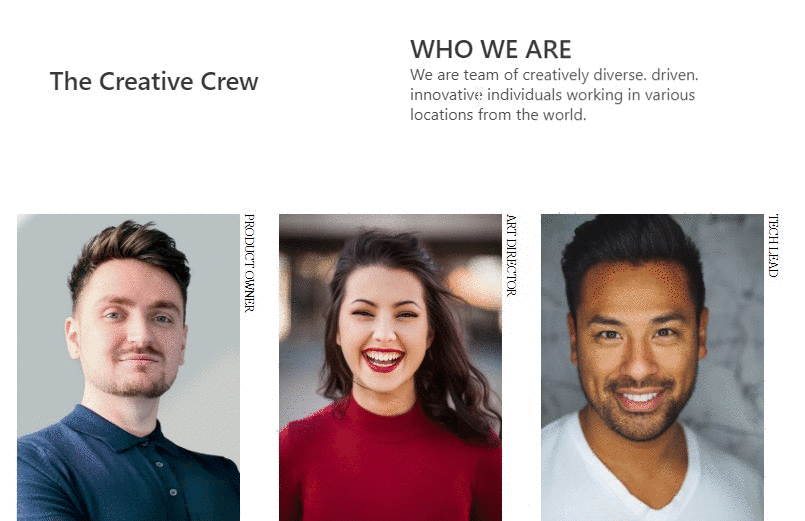

<!-- Please update value in the {}  -->

<h1 align="center">My Team page challenge</h1>

   Solution for a challenge from  <a href="http://devchallenges.io" target="_blank">Devchallenges.io</a>.

<!-- TABLE OF CONTENTS -->

## Overview

This my submission for the [My Team page challenge](https://devchallenges.io/challenges/hhmesazsqgKXrTkYkt0U), with a spooky(?) twist :)

### Built With

HTML + vanilla JS + Bulma
## Features

<!-- List the features of your application or follow the template. Don't share the figma file here :) -->

This application/site was created as a submission to a [DevChallenges](https://devchallenges.io/challenges) challenge. The [challenge](https://devchallenges.io/challenges/hhmesazsqgKXrTkYkt0U) was to build an application to complete the given user stories.

